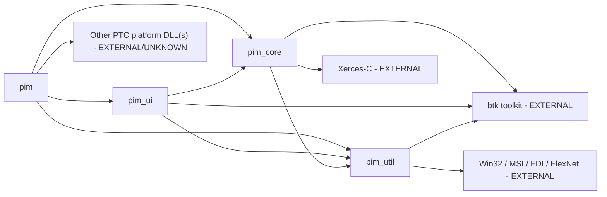
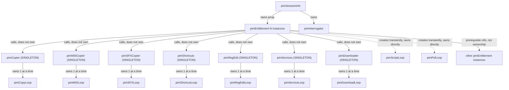

# PIM Architecture Overview

> Built from source evidence in `installmgr.zip` only. See
> `docs/01_repository_inventory.md` §0 for what is and isn't included in this analysis.
> Class-level detail is deferred to `docs/classes/*.md` (Phase 5);
> this document covers structural/architectural relationships only, each backed by a
> cited file.

## 1. System Description

PIM ("Parametric Installation Management") is a Windows native C++ installer
application (per the task brief; not spelled out as an acronym anywhere in the supplied
source itself). It is packaged as:

- A DLL, built from the `pim` module, exporting a small set of "Run" entry points
  (`pimInstallerRun`, `pimRenewLicenseRun`, `pimFrictionlessTrialRun`,
  `pimSilentInstallFromXML`, `pimUninstallFromXML`, etc. — see
  `pim/includes/exp_pim_dll.h`).
- Statically-linked support modules `pim_core` (install engine/state), `pim_ui`
  (dialogs), and `pim_util` (OS/platform/archive/MSI/license utilities).
- One or more small external launcher `.exe`s (`setup.exe`, `pim_rm.exe`, `pim_re.exe`,
  `pim_rl.exe` — named only in code comments, **not included** in this archive) that own
  the real Win32 entry point and call into the DLL.

At runtime it reads one or more **entitlement/product XML files** (Xerces-C DOM),
builds an in-memory model of installable products (`pimEntitlement`), evaluates
prerequisites between them, and executes a sequence of typed "install step" operations
(file copy/archive extraction, MSI install, SFX install, registry edits, shortcuts,
scripts, Windows services, and a "PSF" step of undetermined exact meaning) per product,
all under a UI (`pim_ui`) that lets the user choose products/languages/platforms and
watch progress.

## 2. Major Components

```mermaid
graph TD
    subgraph "pim (DLL, exported entry points)"
        Top["pimTop.cxx\npimInstallerRun / pimFrictionlessTrialRun / pimRenewLicenseRun"]
    end

    subgraph "pim_ui (dialogs)"
        InstallDlg[pimInstallMgrDlg]
        FrictionlessDlg[pimFrictionlessTrialDlg]
        RenewDlg[rpimDlg]
        CustomDlg[pimCustomDlg]
    end

    subgraph "pim_core (engine & state)"
        SessionInfo[pimSessionInfo]
        Interrogator[pimInterrogator]
        Entitlement[pimEntitlement]
        Loop[pimLoop - base class]
        CopyLoop[pimCopyLoop]
        MSILoop[pimMSILoop]
        SFXLoop[pimSFXLoop]
        ScriptLoop[pimScriptLoop]
        ShortcutLoop[pimShortcutLoop]
        RegEditLoop[pimRegEditLoop]
        ServiceLoop[pimServiceLoop]
        PsfLoop[pimPsfLoop]
        DownloadLoop[pimDownloadLoop]
        XmlFile[pimXmlFile]
        PackageMgr[pimPackageMgr]
        PlatformMgr[pimPlatformMgr]
        LanguageMgr[pimLanguageMgr]
        Prerequisite[Prerequisite graph\nwithin pimEntitlement]
        Log[pimLog / pimMessage]
    end

    subgraph "pim_util (OS/platform utilities)"
        Cab[pimCab / pimFdi32]
        MSIUtil[pimMSI]
        FlexNet[pimFLEXnet]
        RegisterProduct[pimRegisterProduct]
        Scramble[pimScramble]
        Windows[pimWindows]
    end

    subgraph "External / EXTERNAL-UNKNOWN"
        BTK["btk toolkit\n(btkString, btkFSEntry, thrThread, btkUnzip/libzip, ui* dialog classes)"]
        Xerces[Xerces-C DOM]
        Win32[Win32 API / Registry]
        MSIPlat[Windows Installer]
        FDI[Windows Cabinet FDI]
        PTCPlatform["Other PTC platform DLL(s)\n(imp_pim_dll.h imports)"]
    end

    Top --> SessionInfo
    Top --> InstallDlg
    Top --> FrictionlessDlg
    Top --> RenewDlg
    Top --> XmlFile

    SessionInfo --> Interrogator
    SessionInfo --> Entitlement

    Entitlement --> Loop
    Entitlement --> Prerequisite
    Entitlement -->|via pimCopier| CopyLoop
    Entitlement -->|via pimMSICopier| MSILoop
    Entitlement -->|via pimSFXCopier| SFXLoop
    Entitlement -->|via pimShortcuts| ShortcutLoop
    Entitlement -->|via pimRegEdit wrapper| RegEditLoop
    Entitlement -->|via pimServices| ServiceLoop
    Entitlement -->|via pimDownloader| DownloadLoop
    Entitlement -->|direct, ad hoc| ScriptLoop
    Entitlement -->|direct, ad hoc| PsfLoop
    Entitlement --> XmlFile

    Loop --> BTK

    InstallDlg --> SessionInfo
    InstallDlg --> PackageMgr
    InstallDlg --> PlatformMgr
    InstallDlg --> LanguageMgr
    CustomDlg --> PackageMgr

    CopyLoop --> Cab
    MSILoop --> MSIUtil
    FlexNet --> Interrogator

    XmlFile --> Xerces
    RegEditLoop --> Win32
    MSIUtil --> MSIPlat
    Cab --> FDI

    Top --> PTCPlatform
    Log --> BTK
```

## 3. Responsibilities

| Component | File(s) | Responsibility (from code) |
|---|---|---|
| `pimTop` functions | `pim/pim_src/pimTop.cxx` | Top-level orchestration for the 3 run modes; build `pimSessionInfo`, load entitlements, choose "product mode", drive the top dialog |
| `pimSessionInfo` | `pim_core/includes/pimSessionInfo.h` | Session-wide state: the entitlement collection (`EntitlementArray`, `InstalledArray`), an `pimInterrogator*`, license/security context (`pimSecurity`, `pimLicenseSource`), arbitrary session properties (`SetProperty`/`GetProperty` string bag used pervasively as a config/context blackboard) |
| `pimInterrogator` | `pim_core/includes/pimInterrogator.h` | Discovers what is already installed / known license sources on the local machine (queried by `pimSessionInfo`, `pimTop.cxx`) |
| `pimEntitlement` | `pim_core/includes/pimEntitlement.h`, `pim_core_src/pimEntitlement.cxx` (7,649 lines — the largest and most central file in the codebase) | Represents one installable "product". Extends `pimLoop` itself (so an entire product install/uninstall runs as one cancelable/pausable threaded unit). Owns/creates the per-product install-step wrappers (`pimCopier`, `pimMSICopier`, `pimSFXCopier`, `pimShortcuts`, `pimRegEdit`, `pimServices`, `pimDownloader`) and directly instantiates `pimScriptLoop`/`pimPsfLoop` where needed. Also owns the prerequisite graph (`AddPrerequisite`/`DropPrerequisite`/`IsPrerequisiteSatisfied`/soft-vs-hard distinction) |
| `pimLoop` | `pim_core/includes/pimLoop.h` | Abstract base (`: public thrThread`, external) giving every install step a uniform threaded contract: `Execute`, `Cancel`, `Pause`/`Resume`, `Wait`, `IsDone`, `HasErrors`/`GetErrors`, `HasWarnings`/`GetWarnings` |
| `pimCopyLoop` | `pim_core/includes/pimCopyLoop.h` | File copy + CAB/ZIP archive extraction/removal (`pimInstallCab`/`pimRemoveCab` — edited this session to use `btkUnzip` for `.zip` instead of the CAB-specific API) |
| `pimMSILoop` / `pimMSICopier` | `pim_core/includes/pimMSILoop.h`, `pimMSICopier.h` | MSI package install; `pimMSICopier` is the thin owner that lazily creates the `pimMSILoop` (`MSILoop = XNew pimMSILoop(xmlPtr);` in `pimMSICopier.cxx`) |
| `pimSFXLoop` / `pimSFXCopier` | `pim_core/includes/pimSFXLoop.h`, `pimSFXCopier.h` | Same wrapper pattern for self-extracting `.exe` packages |
| `pimShortcutLoop` / `pimShortcuts` | `pim_core/includes/pimShortcutLoop.h`, `pimShortcuts.h` | Same wrapper pattern for shortcut creation/removal |
| `pimRegEditLoop` / `pimRegEdit` | `pim_core/includes/pimRegEditLoop.h`, `pimRegEdit.h` | Same wrapper pattern for registry key/value creation; `pimRegEditLoop.cxx` contains the actual Win32 registry calls |
| `pimServiceLoop` / `pimServices` | `pim_core/includes/pimServiceLoop.h`, `pimServices.h` | Same wrapper pattern for Windows service install/start/stop, built on the externally-imported `ginst_*` functions (`pim/includes/imp_pim_dll.h`) |
| `pimDownloadLoop` / `pimDownloader` | `pim_core/includes/pimDownloadLoop.h`, `pimDownloader.h` | Same wrapper pattern for downloading installer payloads over the network |
| `pimScriptLoop`, `pimPsfLoop` | `pim_core/includes/pimScriptLoop.h`, `pimPsfLoop.h` | Install-time script execution and "PSF" file creation/removal; unlike the others these are instantiated directly and transiently inside `pimEntitlement.cxx` rather than through a dedicated owner class — **no wrapper class exists for these two** |
| `pimXmlFile` | `pim_core/includes/pimXmlFile.h`, `pim_core_src/pimXmlFile.cxx` | Wraps Xerces-C DOM parsing/writing for every XML document in the system (product definitions, session state, translations) |
| `pimPackageMgr` / `pimPlatformMgr` / `pimLanguageMgr` | `pim_core/includes/pimPackageMgr.h` etc. | Transient, per-selection managers computing which packages/platforms/languages are applicable for a given product XML; consumed by the UI (`pimInstallMgrDlg`, `pimCustomDlg`) and constructed ad hoc where needed (e.g. inside `pimEntitlement.cxx`'s URL-update logic) |
| `pimLog` / `pimMessage` | `pim_core/includes/pimLog.h`, `pimMessage.h` | Logging (`LG_INFO`/`LG_ERROR`/`LG_DEBUG` macros seen everywhere) and localized message-ID-to-string resolution (backed by `pim_core/messages/<lang>/pim.msg`) |
| `pim_ui` dialogs | `pim_ui/includes/*.h` | `pimInstallMgrDlg` (main product-selection/progress dialog, derives from `uiDialog` — external custom UI toolkit, not MFC), `pimFrictionlessTrialDlg`, `rpimDlg` (renew license), plus ~20 supporting dialogs (`pimAuthDlg`, `pimBrowserDlg`, `pimEulaRefresh`, `pimFlexDlg`, etc.) |
| `pim_util` | `pim_util/includes/*.h` | `pimCab`/`pimFdi32` (legacy CAB), `pimMSI` (MSI API wrapper), `pimFLEXnet` (license source queries), `pimRegisterProduct`, `pimScramble` (string obfuscation used for trial SCN/email/PSF args), `pimWindows` (OS version checks), `pimConvert`, `pimCopyInstaller` |

## 4. Dependencies (module level)

Evidence: `pim/pim_src/pimTop.cxx` `#include`s headers from all three other modules
(`pimSessionInfo.h`, `pimFrictionlessTrialDlg.h`, `pimInstallMgrDlg.h` from `pim_ui`,
`pimMSI.h`, `pimFLEXnet.h`, `pimRegisterProduct.h`, `pimScramble.h` from `pim_util`).
`pim_ui/includes/pimInstallMgrDlg.h` includes `pim_core` managers (`pimPackageMgr`,
`pimPlatformMgr`, `pimLanguageMgr`). No file in `pim_util` was observed including a
`pim_core` or `pim_ui` header, consistent with `pim_util` being the lowest layer.

## 5. Ownership

> **Corrected 2026-09 after a deeper trace of the 7 owner-wrapper headers while
> documenting the remaining Loop subclasses at full depth.** The original version
> of this section (and this document's own earlier text) described the 7
> owner-wrapper classes as per-`pimEntitlement` owned objects, each wrapping
> exactly one Loop instance. That was **wrong for 6 of the 7** — only
> `pimEntitlement`'s use of them looks that way from the call sites; the wrapper
> classes themselves are process-wide singletons. See
> `docs/classes/pimCopyLoop.md`'s Ownership Model section for the source evidence
> (`pimCopier::OnlyCopier`/`GetInstance()`), and `docs/classes/pimSFXLoop.md`,
> `pimScriptLoop.md`, `pimShortcutLoop.md`, `pimServiceLoop.md`, `pimPsfLoop.md`,
> `pimDownloadLoop.md` for each sibling Loop type's confirmation.
>
> **Second correction, 2026-09, after a full header+`.cxx` read of all 7
> owner-wrapper classes themselves** (`docs/classes/{pimCopier,pimMSICopier,
> pimSFXCopier,pimShortcuts,pimRegEdit,pimServices,pimDownloader}.md`): the 7
> singletons do **not** all enforce "one operation at a time" the same way.
> **`pimServices`' own `xmlMutex.TryLock()` does not actually serialize whole
> operations** — it is released immediately after starting the operation's
> thread (a confirmed stale-comment/copy-paste bug), so a second concurrent
> `Create()`/`Uninstall()` call would delete a still-running `pimServiceLoop`
> out from under its own thread. `pimMSICopier` and `pimSFXCopier` share **one**
> external gate (`pimOKToRunMsiexec()`/`pimFreeMsiexec()`, `pim_util`) rather
> than each having an independent internal mutex — an MSI install and an SFX
> install cannot run concurrently even though they are different classes.
> `Cancel()` propagates into the owned Loop for only 3 of the 7 (`pimCopier`/
> `pimMSICopier`/`pimSFXCopier`); the other 4 (`pimShortcuts`/`pimRegEdit`/
> `pimServices`/`pimDownloader`) are flag-only, compensated for at every
> confirmed call site by a cancel-then-grace-period-then-`Kill()` idiom. See
> `ai-context/business_rules.yaml` and `ai-context/ownership.yaml`'s
> `locking_contract_variants`/`cancel_propagation_variants` for full detail.

**Corrected model**: all 7 of `pimCopier`, `pimMSICopier`, `pimSFXCopier`,
`pimShortcuts`, `pimRegEdit`, `pimServices`, and `pimDownloader` are
**process-wide singletons** (`static pimXxx *OnlyXxx; static pimXxx&
GetInstance();`), not per-entitlement owned objects. Each singleton owns exactly
one Loop instance *at a time*, created fresh on each operation and deleted when
that operation finishes; entry to a new operation is gated by
`xmlMutex.TryLock()` on the singleton, so **at most one operation of each given
type (one copy, one MSI install, one SFX install, one shortcut op, one registry
op, one service op, one download) can be in flight across the entire process at
any moment**, no matter how many `pimEntitlement` threads are simultaneously
"installing." A `pimEntitlement` wanting to, say, copy files calls
`pimCopier::GetInstance().Copy(xmlPtr, ...)`; if that returns `0` (busy), the
entitlement's own thread must poll/retry rather than proceeding — it does not own
a private `pimCopier`. `pimCopier` additionally has **two** singleton instances
(`OnlyCopier` for install-copies, `OnlyUninstallCopier` for uninstall/rollback
copies), giving those two operation classes independent serialization domains;
the other 6 wrapper classes each have only one singleton instance, now confirmed
by a full read of every one of their `.cxx` files (see the second correction
above for what that full read additionally revealed: the "one operation at a
time" guarantee is not uniformly enforced across all 7).

`pimScriptLoop` and `pimPsfLoop` remain the two genuine exceptions to the
singleton pattern — confirmed correct in the original analysis. `pimEntitlement`
really does create and destroy these two directly, per-call, with no wrapper of
any kind (`pimEntitlement.cxx` lines ~5629, ~5744, ~6972, ~6995, ~7087, ~7121,
~7349, ~7369). Unlike the 7 singleton-owned Loop types, script and PSF generation
for different entitlements **can** run fully concurrently, since there is no
shared singleton serializing them.

Prerequisites are **references, not ownership**: `AddPrerequisite(pimEntitlement*, bool
soft)` stores a pointer to another already-existing `pimEntitlement` (owned by
`pimSessionInfo`'s arrays), it does not construct one.

## 6. Interfaces

The only formal, documented interface boundary in the supplied source is the DLL
export contract in `pim/includes/exp_pim_dll.h` (full list in
`docs/01_repository_inventory.md` §4-§5). Internally, module boundaries are informal
C++ header/include boundaries — there is no COM, IPC, or plugin interface observed
between `pim`, `pim_core`, `pim_ui`, `pim_util`.

`pim/includes/imp_pim_dll.h` is the mirror-image *inbound* interface: symbols the `pim`
DLL expects to be provided by some other, unincluded PTC binary (service control,
i18n/locale, exit handling, `authorize_main`). **UNKNOWN** which binary supplies these.

## 7. Startup Overview

(Full trace in `docs/03_application_startup.md`, Phase 3.)
At a glance, `pimInstallerRun` (`pim/pim_src/pimTop.cxx`) performs, in order:
`btki18nSetup()` → `pimXmlInit()` → parse CLI args (`pimCommandLineArgs`) →
`pimGeneralInit()` → `pimBrowserInit()` → `InitLog()` → `pimUIInit(false)` → locate a
physical media image or fall back to network entitlement discovery → construct
`pimSessionInfo` → load applicable entitlement XML files into it
(`SessionInfo.AddEntitlement(...)`) → determine "product mode" (Creo/Mathcad/WGM/
Schematics/MKS/FlexOnly/ARPlugin/CreoHelp) → construct and `Initialize()`/`Refresh()`/
`Display()` a `pimInstallMgrDlg` → on return, `Wait()` on every entitlement's thread →
write UUID/registry bookkeeping → log goodbye → `SessionInfo.PrepareForShutdown()` →
`pimUITerminate(true)` → `ptc_exit_run(1)` → `btki18nCleanup()`.

## 8. Shutdown Overview

Each of the three `pimTop.cxx` run functions ends with the same teardown sequence:
log a goodbye message (`pimLogGoodbye`), `SessionInfo.PrepareForShutdown()` (comment:
"do these so setup.exe can unload the dll"), conditionally `pimUITerminate(true)`
("this should unload any compiled_resource dll files") unless the failure was itself a
UI-init failure, `ptc_exit_run(1)` (external/`imp_pim_dll.h`), then `btki18nCleanup()`.
No explicit rollback-on-shutdown call is visible in this top-level path; rollback
appears to be handled per-entitlement during the install flow itself (`pimEntitlement`
exposes rollback-related logic — see `pimCopyLoop::OnRollbackCabs`,
`pimEntitlement.cxx`'s `RollbackMe`-prefixed local blocks at the `pimScriptLoop`/
`pimPsfLoop` instantiation sites found above). Full detail is in
`docs/04_installation_flow.md` (Phase 7), including `OnReconfigure()`/`OnRollback()`'s
own confirmed teardown/rollback sequences.

## 9. Open Questions / UNKNOWN for Future Phases

- Exact meaning of "PSF" (`pimPsfLoop`) — no defining comment found.
- Identity of the external PTC platform DLL(s) behind `imp_pim_dll.h`.
- Identity/location of the launcher `.exe` projects.
- Full prerequisite satisfaction algorithm (`IsPrerequisiteSatisfied`) — header-only
  seen so far; implementation is in `pimEntitlement.cxx` and belongs in Phase 8.
- Full registry key inventory — belongs in Phase 10 (`docs/07_registry_usage.md`).

---
*Phase 2 of the requested 20-phase documentation set. Builds directly on
`docs/01_repository_inventory.md`. No source was modified.*
