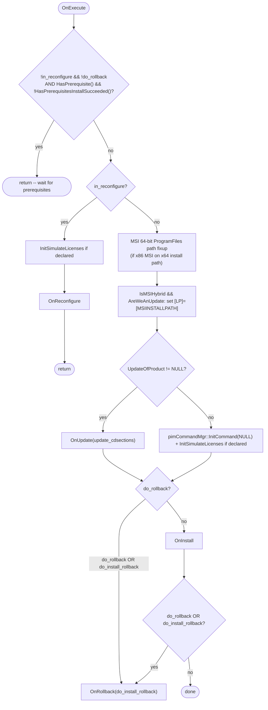

# PIM Installation Flow

> Traced from `pim_core/pim_core_src/pimEntitlement.cxx` (`OnExecute`, `OnInstall`,
> `OnUpdate`, `OnReconfigure`, `OnRollback`) — the 7,649-line file backing
> `pimEntitlement`. This document covers **one entitlement's** install/update/
> reconfigure/uninstall pipeline; the outer per-session flow (locating entitlements,
> showing the dialog) is in `docs/03_application_startup.md`. No source was modified.
> This corrects one detail from earlier phases — see §6.

## 1. Entry Point: `pimEntitlement::OnExecute()`

This is the thread body invoked when `Execute()` (inherited from `pimLoop`) spawns an
entitlement's worker thread (via `StartOrRestartInstall()`/`Uninstall()`/
`Reconfigure()`). It is a **dispatcher**, not the pipeline itself:



`is_license_server_transition` (checked via a session-XML property) suppresses
CDSECTION refresh during `OnUpdate` — a special case for license-server-to-license-
server version transitions (added per revision `$$47`, "Add progress bar for License
Server installation").

## 2. Main Flow: `OnInstall()` (fresh install / the common path)

`OnInstall()` is one large sequential method (spanning source lines ~5860–6863) built
around **XML-declared skip flags** (`xmlPtr->GetProperty("NoXxx", ...)`) that let a
product's definition file opt out of individual pipeline stages, and **custom-action
hook points** (`OnInstallCustomActions("<When>", ...)`) that run XML-declared actions
before/after specific stages. Percent-complete (`total_pct_done`, under `PctMutex`) is
updated at nearly every stage boundary for UI progress reporting.

```mermaid
sequenceDiagram
    participant Ent as pimEntitlement::OnInstall
    participant Copier as pimCopier (owns pimCopyLoop)
    participant MSI as InstallMSI()
    participant Reg as pimRegEdit (singleton, owns pimRegEditLoop)
    participant Scripts as pimScriptLoop (transient)
    participant Svc as pimServices (owns pimServiceLoop)
    participant Psf as pimPsfLoop (transient)
    participant Shortcuts as pimShortcuts (owns pimShortcutLoop)

    Note over Ent: SetupConverter(Converter, xmlPtr)
    opt UpdateOfProduct != NULL (this install supersedes an existing one)
        Ent->>Ent: OnInstallCustomActions("PreUpgrade", true)
        Ent->>Ent: remove previous uninstall registry entry (pimRemoveUninstallRegKey)
        Ent->>Ent: remove previous PTC install record (pimRemovePTCRecord)
        Ent->>Ent: UpdateOfProduct->UninstallShortcuts()
        Ent->>Ent: UpdateOfProduct->UninstallService()
        Note over Ent: CommonFiles-still-needed check via a fresh pimInterrogator (only outside FlexOnly/WGM modes)
    end
    Ent->>Ent: OnInstallCustomActions("PreInstall", true)
    Note over Ent: cancel checks + (untraced-in-depth) prerequisite/disk-space validation, ~lines 5940-6240
    alt no MSI/EngNotebook component, or NoPreCopyMSI set (pre-copy path)
        Ent->>Copier: StartCopy()
    end
    Note over Ent: create Add/Remove Programs uninstall entry (pimInitializeUninstall, pimWriteLocation, pimWriteVersion -- direct registry writes, not via pimRegEditLoop)
    opt HasMSIInstall() || HasEngNotebookInstall()
        Ent->>Ent: OnInstallCustomActions("PreMSIConfigure")
    end
    alt HasMSI/EngNotebook, !NoPreCopyMSI, (update-or-new), run_msi
        Ent->>MSI: InstallMSI()  %% pre-copy MSI install
    end
    opt !NoCopyStep
        alt not already started above
            Ent->>Copier: StartCopy()
        end
        Ent->>Copier: WaitForCopyToComplete()
    end
    alt HasMSI/EngNotebook, !NoPostCopyMSI, (update-or-new)
        Ent->>MSI: InstallMSI()  %% post-copy MSI install
    end
    Ent->>Ent: OnInstallCustomActions("PostCopy", true)
    opt !NoRegistryActions
        Ent->>Reg: ApplyRegistryChanges()
    end
    opt !NoScripts
        Ent->>Scripts: InstallScripts()
    end
    opt !NoServices
        Ent->>Svc: PerformServiceAction()
    end
    opt !NoPSF
        Ent->>Psf: InstallPSF()
    end
    opt !NoShortcuts && !pimGetCreoNGCRIMode()
        Ent->>Shortcuts: InstallShortcuts()
    end
    Ent->>Ent: cancel check (see Error Paths)
    Ent->>Ent: OnInstallCustomActions("PostInstall", false, false)
    opt UpdateOfProduct != NULL
        Ent->>Ent: OnInstallCustomActions("PostUpgrade", false, false)
    end
    Note over Ent: total_pct_done=100; status = Complete / CompleteWithWarnings / CompleteWithErrors (from CA_WARNINGS[_WITH_ERROR] properties)
```

### Notable branching conditions (exact, from source)

| Condition | Effect |
|---|---|
| `xmlPtr->GetProperty("NoCopyStep", str)` | Skips the file/archive copy step entirely |
| `!HasMSIInstall() && !HasEngNotebookInstall()` **or** `NoPreCopyMSI` set | Copy runs *before* any MSI work (the "pre-copy" branch) |
| `HasMSIInstall() || HasEngNotebookInstall()` and NOT `NoPreCopyMSI` and (`IsMSIAnUpdate(true)` or `IsMSINewInstall()`) and `run_msi` | MSI installs *before* the copy step |
| `pimGetProductMode() == PIM_MATHCAD_MODE && !pimGetPrimeMSIRunStatus() && IsMSIHybrid()` | Forces `run_msi = false`, skipping the pre-copy MSI install specifically for Mathcad hybrid installs when "Prime MSI run status" is off |
| `HasMSIInstall() || HasEngNotebookInstall()` and NOT `NoPostCopyMSI` and (update-or-new) | MSI installs *after* the copy step too (both pre- and post-copy MSI calls can fire in the same run for hybrid setups) |
| `NoRegistryActions` / `NoScripts` / `NoServices` / `NoPSF` / `NoShortcuts` | Each individually skips its pipeline stage |
| `pimGetCreoNGCRIMode()` | Additionally suppresses shortcuts regardless of `NoShortcuts` |
| `GetTag() == "mathcad.xml"` | At completion, derives and records an install path for utility registration via 4 levels of `GetHead()` on the XML's own path |

## 3. Alternate Flow: `OnUpdate()` / Upgrade Pre-Cleanup

When `UpdateOfProduct != NULL`, `OnInstall()`'s first block (before the main pipeline)
performs upgrade-specific cleanup of the *previous* version, all before the new
version's own pipeline runs:

1. `OnInstallCustomActions("PreUpgrade", true)` — abort the whole install if this fails.
2. Unless `NoUninstallEntry` is set on the *old* product's XML: compute the old
   product's uninstall display name (`GenerateUninstallName`) and remove its
   Add/Remove-Programs registry key (`pimRemoveUninstallRegKey`).
3. Unless `NoPTCInstallRecord` is set: read the old product's `<PRODUCT>` root
   attributes (`arp`/`name`, `version`) and call `pimRemovePTCRecord`.
4. Unless `NoShortcuts` is set (and not in Creo-NGCRI mode): `UpdateOfProduct->UninstallShortcuts()`.
5. Unless `NoServices` is set: `UpdateOfProduct->UninstallService()` — **aborts the
   whole install if this returns false**.
6. If `IsParentOnly()`: check whether it's OK to uninstall (shuts down running
   processes under "Common Files" if needed) — result not gated on, informational.
7. Otherwise (not parent-only): FlexOnly-mode-specific cleanup of a stale FlexNet
   server install directory, or (outside WGM mode) a check of whether "Common Files"
   from the *old* version are still referenced by any other installed product before
   any related cleanup — this logic uses a **fresh `pimInterrogator`** instance
   (`CheckCF.Refresh()` + `GetAllCommonFilesUsers`) to re-scan the machine state
   rather than trusting cached session data (revision `$$46`, "Cleanup previous
   version before new version installation starts").

## 4. Alternate Flow: `OnReconfigure()`

Triggered directly from `OnExecute()` when `in_reconfigure` is set, bypassing
`OnInstall()` entirely. Per its own comment, it operates on the **cached `xmlPtr`**
(the already-installed product's saved XML under `pim/xml`), not a fresh
product-definition file. Now fully traced (`pim_core_src/pimEntitlement.cxx:6866-7222`)
— see `docs/classes/pimEntitlement.md`'s Risk Analysis for the confirmed stage
order and a **CONFIRMED BUG, HIGH SEVERITY**: an unconditional `Erase()` of the
entitlement's own cached XML file at the top of the function, as a side effect
of computing an unrelated path, with 2 confirmed early-return paths (a
service-stop failure, or a `PreReconfigure` custom-action failure) that leave
the deleted cache file never recreated.

## 5. Error Paths

- **Prerequisite gate** (`OnExecute`): if hard prerequisites aren't satisfied, the
  thread returns immediately without touching `OnInstall`/`OnRollback` at all — the
  caller (see `InstallPreReqSilent` in `pim/pim_src/pimTop.cxx`) is responsible for
  installing the prerequisite and re-invoking.
- **Per-stage failure**: nearly every pipeline call in `OnInstall()` is gated
  `if (!StepCall()) { return; }` — a failure in any one stage **aborts the rest of the
  pipeline immediately**; there is no "continue and report" mode for the mandatory
  stages (only the individually-skippable `NoXxx`-flagged stages are optional by
  design, not by failure tolerance).
- **Cancellation**: `IsCancelFlagSet()` is checked at multiple points throughout
  `OnInstall()` (at least 7 distinct checks found). On a check that trips, the status
  message is set to `pimInstallStateCancelled` and the method returns.
- **Conditionally-compiled rollback-on-cancel**: at several cancel points, the code
  does:
  ```cxx
  #ifdef ROLLBACK_CANCELLED_INSTALL
      do_install_rollback = true;
  #endif
  ```
  **`ROLLBACK_CANCELLED_INSTALL` is not `#define`d anywhere in this archive's headers
  or source.** If it is not supplied as a compiler flag by the (unincluded) build
  system, this means **canceling mid-install in the current build does not
  automatically trigger `OnRollback()`** — the entitlement simply stops where it is.
  This is worth confirming against the actual build configuration before relying on
  documented rollback-on-cancel behavior.
- **Registry-stage cancellation** (`ApplyRegistryChanges`, see §7 correction below):
  has its own richer cancel-handling loop — on cancel it calls `RegEdit.Cancel()`,
  polls for up to `KILL_COUNT` iterations waiting for the singleton to leave
  `CancelFlagSet` state, and calls `RegEdit.Kill()` if it doesn't yield in time. This
  is more defensive than the plain `return false` seen in most other stages.

## 6. Recovery Path: `OnRollback(bool from_during_install)`

Invoked from `OnExecute()` when `do_rollback` or `do_install_rollback` is set (the
`from_during_install` parameter distinguishes "this is an explicit user-requested
rollback" from "this is an install that failed partway and rollback was requested").
Now fully traced (`pim_core_src/pimEntitlement.cxx:7287-7565`) — see
`docs/classes/pimEntitlement.md`'s Risk Analysis. Confirmed sequence:

1. `OnUninstallCustomActions("PreUninstall", false, false)` — a failure here is only
   logged (`LG_ERROR`); it does **not** abort the rest of rollback, the opposite of
   `OnReconfigure()`'s fail-fast custom-actions handling.
2. Optional cache-location reset back to Application Data (`NoLPXmlLog` gated) —
   confirmed to have **no** `Erase()` side effect, unlike `OnReconfigure()`'s
   equivalent (and buggy) relocation block.
3. `UninstallShortcuts()`.
4. **PSF rollback** (`pimPsfLoop`, `SetRollback(true)`).
5. **Scripts rollback** (`pimScriptLoop`, `SetRollback(true)`).
6. **Services uninstall** (`pimServices::GetInstance()`, busy-retry + status-poll
   loop, same shape as `OnInstall()`'s install-side loop).
7. **Registry rollback**, via a **process-wide singleton**:
   ```cxx
   pimRegEdit& RegEdit = pimRegEdit::GetInstance();
   pimRegEdit::RegEditStatus re_stat;
   int re_ret = RegEdit.Uninstall(xmlPtr);
   while ((re_stat = RegEdit.Status(pct)) == pimRegEdit::InProgess) { ... }
   ```
8. **Copier rollback/uninstall** — branches on `from_during_install`
   (`Copier.Rollback(xmlPtr)` vs. `Copier.Uninstall(xmlPtr)`), the 1st of exactly 2
   confirmed `from_during_install`-specific branch points in this function.
9. PTC install-record removal, then uninstall-registry-key removal.
10. Only when `from_during_install`: empty "Common Files" directory cleanup, but
    only for the `creobase.xml` entitlement — the 2nd and final confirmed
    `from_during_install` branch point.

**Confirmed: this function has zero early-return points** — every stage runs
unconditionally to completion regardless of any individual stage's outcome,
consistent with a rollback/cleanup path's need to attempt every teardown step
even if one fails (reinforced by step 1's log-and-continue handling).

## 7. Correction to Earlier Phases: `pimRegEdit` is a Singleton, Not a Per-Entitlement Wrapper

`docs/02_architecture_overview.md` §5 and `docs/modules/pim_core.md` described
`pimRegEdit` as following the same "one owner, one owned Loop" pattern as `pimCopier`/
`pimMSICopier`/etc. (based on the constructor pattern `RegEditLoop = XNew
pimRegEditLoop(xmlPtr);` seen in `pimRegEdit.cxx`). **Reading the actual call sites in
`pimEntitlement.cxx` (`ApplyRegistryChanges()` and `OnRollback()`) shows this is
incomplete**: `pimRegEdit` is accessed exclusively through a **process-wide singleton**
(`pimRegEdit::GetInstance()`), not constructed per-entitlement. `Create(xmlPtr)`
returning `false` is explicitly documented in the polling loop as meaning "busy" —
i.e., **the singleton appears to serialize registry operations across all
concurrently-installing entitlements**, retrying with `Sleep(5)` until it accepts the
new request. The per-XML `pimRegEditLoop` instance it creates internally
(`RegEditLoop = XNew pimRegEditLoop(xmlPtr);`) is presumably swapped out or reused per
call to `Create`/`Uninstall`, not held one-per-entitlement as the other 6 wrapper
classes are. This is a materially different concurrency model than the rest of the
Loop family and should be treated as such in any future work touching registry
install steps — e.g. it explains why registry operations across multiple
simultaneously-installing products would serialize rather than run in parallel, unlike
copy/MSI/shortcut/service operations which run one per entitlement thread
independently.

## 8. Verification Logic

No dedicated **post-install verification** step (e.g. re-reading installed registry
keys/files to confirm they match expectations) was found as a distinctly-named stage
in this pass. The closest analogs found are pre-install *checks* rather than
post-install *verification*: `IsMSISameVersionInstalled`/`IsSFXSameVersionInstalled`
(skip re-install if already current), `IsPrerequisiteSatisfied` (gate before starting),
and `CheckOKToInstall`/`CheckOKToUninstall` (pre-flight eligibility checks). Whether a
true post-install verification pass exists elsewhere (e.g. in `pim_ui`'s progress
dialog reconciling `GetInstallStatus()` against expected state) was not confirmed in
this pass — flagged as **UNKNOWN**, worth a targeted follow-up read of
`pimProgressRefresh.cxx` (`pim_ui`) if verification behavior specifically needs
documenting.

## 9. Open Questions Carried Forward

- Whether `ROLLBACK_CANCELLED_INSTALL` is defined via an external build flag (§5).
- Whether a distinct post-install verification stage exists in `pim_ui` (§8).
- The disk-space/prerequisite validation block referenced but not traced in `OnInstall`
  (source lines roughly 5940–6240, between the upgrade-cleanup block and the first
  `StartCopy()` call).

---
*Phase 7 of the requested 20-phase documentation set. No source was modified.*
