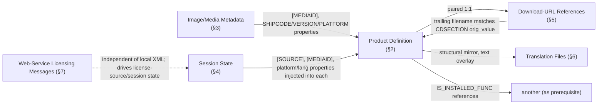

# PIM XML Configuration

> Reverse-engineered entirely from parsing/consumption code — **no actual `.xml`
> sample files are present in this archive** (confirmed in
> `docs/01_repository_inventory.md` §0/§8). Every element/attribute name below is a
> literal constant in `pim_core/includes/pimDefs.h` (1,263 lines, ~230 distinct
> `pimXxx` constants) cross-referenced against where each is actually read/written in
> `pim_core`/`pim`/`pim_util`/`pim_ui`. Where a name's exact role could not be pinned
> to a specific read/write call site in this pass, it is marked UNKNOWN rather than
> guessed. No source was modified.

## 1. Document Types Identified

PIM's `pimXmlFile` wrapper (`docs/classes/pimXmlFile.md`) is used for at least 6
structurally distinct kinds of document, distinguished by root element and consuming
code, not by file extension (all appear to be `.xml`, sometimes further qualified
like `.p.xml` seen in `pimEntitlement.cxx`'s `LateLPXmlLog` handling):

| # | Document type | Root element (constant) | Primary consumer |
|---|---|---|---|
| 1 | Product/Entitlement Definition | `<PRODUCT>` (`pimPRODUCT`) | `pimEntitlement` (via `Init()`) |
| 2 | Image/Media Metadata | Contains `<FAMILY>`/`<ENTITLEMENT>`/`<PTCSETUP>` nodes | `pim/pim_src/pimTop.cxx` (`docs/03_application_startup.md`) |
| 3 | Session State | Contains `<PROPERTY>`/`<PROPERTIES>`, `<PIMSETUP>` (`pimPIMSETUP`) | `pimSessionInfo` |
| 4 | Download-URL References | `<url>`-bearing document paired 1:1 with a product definition | `pimEntitlement::UpdateUrls`/`UpdateMediaUrls` (`docs/classes/pimEntitlement.md`) |
| 5 | Translation Files | Matches product-definition structure, overlaying localized text | `pimTranslateMgr` |
| 6 | Web-service (SOAP-like) License Request/Response | `<...RequestMsg>`/`<...ResponseMsg>` under PTC namespaces (`pimNSlic`, `pimNSweb`, `pimNSser`, `pimNSmedia`) | `pim_core`'s `pimGetMediaDetails`, `pimPTCDotCom`, `pim_ui`'s `pimPTCLicenseGet`/`pimPTCRenewLicenseGet`/`pimFrictionlessTrialLicenseGet` |

## 2. Document Type 1: Product/Entitlement Definition (`<PRODUCT>`)

The core document type — one per installable product, parsed by
`pimEntitlement::Init()`. Confirmed structure (from `pimEntitlement.cxx`,
`pimCopyLoop.cxx`, `pimPrerequisite.cxx`, `pimRegEditLoop.cxx` read/write call sites
documented in earlier phases):

```
<PRODUCT name="..." version="..." shipcode="..." arp="..." parent="...">
  <PROPERTIES>
    <PROPERTY name="...">value</PROPERTY>          <!-- generic key/value bag, see docs/classes/pimXmlFile.md -->
  </PROPERTIES>
  <CDSECTION installed="Y|N" orig_value="...">...</CDSECTION>   <!-- one per file-copy/archive payload item, docs/04_installation_flow.md -->
  <DISTRIBUTION from="...">
    <MSI install="Y|N" upgradecode="..." version="..." pf32="Y|N">...</MSI>   <!-- docs/05_prerequisite_framework.md §4 (pimWGMTestVFS) -->
    <SFX>...</SFX>
  </DISTRIBUTION>
  <REGISTRY id="..." valuename="..." valuetype="...">value</REGISTRY>   <!-- docs/07_registry_usage.md §2 -->
  <SHORTCUT>...</SHORTCUT>
  <SCRIPT>...</SCRIPT>
  <SERVICE>...</SERVICE>
  <CUSTOMACTION when="PreUpgrade|PreInstall|PreMSIConfigure|PostCopy|PostInstall|PostUpgrade|PreUninstall|...">...</CUSTOMACTION>  <!-- docs/04_installation_flow.md -->
  <PREREQUISITE>
    <IS_INSTALLED_FUNC creoagent_version="..." creosvcs_version="...">pimCreoTestPlatformAgent</IS_INSTALLED_FUNC>  <!-- docs/05_prerequisite_framework.md -->
  </PREREQUISITE>
  <PSF>...</PSF>              <!-- consumed by pimPsfLoop; PSF's exact expansion is UNKNOWN, see docs/01_repository_inventory.md §7 -->
  <PSF_TEMPLATE>...</PSF_TEMPLATE>
</PRODUCT>
```

**This is a structural reconstruction from code evidence, not a captured real file —
attribute co-occurrence, ordering, and nesting depth beyond what's explicitly
confirmed by a read/write call site should not be assumed exact.**

### 2.1 Root Attributes (all confirmed via `map->getNamedItem(pimXxx)` call sites)

| Attribute | Constant | Read at |
|---|---|---|
| `name` | `pimname` | `pimTop.cxx` (family detection), `pimEntitlement::GenerateUninstallName` |
| `version` | `pimversion` | Multiple (`pimEntitlement::GetVersion`, `pimSetDestinationPathFromXML`) |
| `shipcode` | `pimshipcode` | `pimTop.cxx`, `pimEntitlement::GenerateUninstallName` |
| `arp` | `pimARP` | `pimEntitlement::GenerateUninstallName`/`GetARP` (Add/Remove Programs display name override) |
| `parent` | `pimparent` | `pimSetDestinationPathFromXML` (matches `"creobase.xml"` to identify child products) |

### 2.2 `<PROPERTY>`/`<PROPERTIES>` Generic Bag

Confirmed by `pimXmlFile::SetProperty`/`GetProperty` (`docs/classes/pimXmlFile.md`):
`<PROPERTY name="X" attrib="Y">Z</PROPERTY>` — value is either the attribute named by
`attrib` (if given) or the element's text-node content. Session/entitlement code
treats property names as **string keys with no central schema** — see
`docs/06_entitlement_framework.md` §4 and `pimSessionInfo.h`'s `*_PROPERTY` `#define`
catalog (documented with Doxygen comments in this session's Phase 6 patch) for the
largest confirmed subset. Bracket-named properties (`[LP]`, `[INSTALLBASE]`,
`[SOURCE]`, `[MEDIAID]`, `[THIS_ARCH]`, `[THIS_LANG]`, `[VERSION]`, `[SHIPCODE]`,
`[ICON]`, `[PROGRAMFILES]`, `[PROGRAMFILESx86]`, `[MSIINSTALLPATH]`,
`[Update MOR PATH]`, `[OLDCREOCOMMONFILES]`) are resolved by `pimConvert`
(`SetupConverter`, `docs/classes/pimEntitlement.md`) — this bracket-name convention is
distinct from plain `PROPERTY name=` values and appears to specifically mark
placeholders meant for path/context substitution.

### 2.3 `<CDSECTION>` — File/Archive Payload Items

Confirmed attributes: `installed` (`piminstalled`, `"Y"`/absent — drives
`pimCopyLoop::SetUninstall()`'s selection, `docs/classes/pimCopyLoop.md`) and
`orig_value` (`pimorig_value` — preserves the original download-URL trailing filename
before it's rewritten to a full path, `pimEntitlement::UpdateUrls`,
`docs/classes/pimEntitlement.md`).

### 2.4 `<DISTRIBUTION>`/`<MSI>`/`<SFX>` — Installer Payload Declarations

`<DISTRIBUTION from="...">` (`pimfrom`) holds the URL root for network-downloaded
payloads (`pimEntitlement::UpdateUrls`). Its `<MSI>` children carry `install`
(`piminstall`, `"Y"`/`"N"`), `upgradecode` (`pimUPGRADECODE`), `version`
(`pimversion`), and `pf32` (32-bit-MSI-on-64-bit-install-path marker, seen in
`pimEntitlement::OnExecute()`, `docs/04_installation_flow.md` §1).

### 2.5 `<PREREQUISITE>`/`<IS_INSTALLED_FUNC>`

Fully documented in `docs/05_prerequisite_framework.md` §4 — the function-name
dispatch mechanism. `pimPREREQUISITE` and `pimIS_INSTALLED_FUNC` are the constants;
only `creoagent_version`/`creosvcs_version` attributes were confirmed read from this
element (for the `pimCreoTestPlatformAgent` rule specifically).

### 2.6 `<CUSTOMACTION>`

Confirmed lifecycle-point strings passed as the `when` parameter to
`OnInstallCustomActions`/`OnUninstallCustomActions` (`docs/04_installation_flow.md`):
`"PreUpgrade"`, `"PreInstall"`, `"PreMSIConfigure"`, `"PostCopy"`, `"PostInstall"`,
`"PostUpgrade"`, `"PreUninstall"`. The `pimCUSTOMACTION` tag constant exists;
`pimwhen` is presumably the attribute holding this string (name matches the
lifecycle-point parameter), though the exact attribute vs. element-content encoding
was not independently re-verified against a `getAttribute`/`getTextContent` call in
this pass.

### 2.7 Other Confirmed-Present Elements Not Fully Traced This Pass

`pimSHORTCUT`, `pimSCRIPT`, `pimSERVICE`, `pimPSF`, `pimPSF_TEMPLATE`,
`pimDELETEPSF`, `pimCOMMONFILES`, `pimHIDDEN_PRODUCT`, `pimREQUIRED`,
`pimREQUIRE_OPTION`/`pimREQUIRE_OPTION_SET` — all present as constants and
consistent with the module doc's described `pimShortcutLoop`/`pimScriptLoop`/
`pimServiceLoop`/`pimPsfLoop` step types (`docs/modules/pim_core.md`), but their
individual attribute schemas were not traced to specific call sites in this pass.

## 3. Document Type 2: Image/Media Metadata

Confirmed structure from `pim/pim_src/pimTop.cxx` (`docs/03_application_startup.md`
§3–4):

```
<... root, exact tag UNKNOWN ...>
  <FAMILY name="...">...</FAMILY>            <!-- e.g. "Windchill Workgroup Manager" -->
  <ENTITLEMENT>...</ENTITLEMENT>             <!-- counted to derive can_be_flexonly_cdimage -->
  <PTCSETUP shipcode="..." version="...>     <!-- pimPTCSETUP / pimPIMSETUP; read via GetNextNodelistItem(pimPIMSETUP) in the network-install branch -->
  <PROPERTY name="SHIPCODE">...</PROPERTY>   <!-- via pimSHIPCODE/pimDATECODE/pimLABEL/pimBANNER_NAME/pimBANNER_VER/pimPLATFORM text-node reads -->
</...>
```

Read via `GetTextNode` for `pimSHIPCODE`, `pimDATECODE`, `pimLABEL`,
`pimBANNER_NAME`, `pimBANNER_VER`, `pimPLATFORM` (all confirmed call sites in
`pimTop.cxx`). This is the document `pimInstallerRun` loads once to determine the
overall media's shipcode/version/platform/banner before enumerating individual
product-definition files that reference it via `[MEDIAID]`.

## 4. Document Type 3: Session State

Backs `pimSessionInfo`'s property bag (`docs/classes/pimSessionInfo.md`). Uses the
same generic `<PROPERTY>` mechanism as product XML, keyed by the ~30 `*_PROPERTY`
constants cataloged there, plus a `<PIMSETUP>`-tagged node
(`GetNextNodelistItem(pimPIMSETUP, true)`) carrying `shipcode`/`version` attributes
(`pimshipcode`/`pimversion`) read directly in the network-install branch of
`pimInstallerRun` (`docs/03_application_startup.md` §3).

## 5. Document Type 4: Download-URL References

A separate `pimXmlFile*` (`download_url_references` parameter to
`pimEntitlement::Init`, `current_download_url_references` member) holding `<url>`
elements (`pimURL`/lowercase content match, per `GetNextNodelistItem(pimurl, ...)` in
both `pimEntitlement.cxx` and `pim/pim_src/pimTop.cxx`) plus sibling `<filesize>`
nodes (`pimfilesize`, read via `GetChildNodeByNodeName(ParentToUrlNode, pimfilesize)`
in `pimEntitlement::UpdateUrls`). Each URL's trailing filename (after stripping the
root and any `?query`) is matched against a `<CDSECTION>` entry's `orig_value`
attribute or text content — this is the exact mechanism that ties a downloaded file
back to its corresponding install-payload declaration in the product XML (§2.3).

## 6. Document Type 5: Translation Files

Consumed by `pimTranslateMgr::TranslateFrom(file)`
(`docs/03_application_startup.md` §4, `docs/modules/pim.md`), now fully traced —
see `docs/classes/pimTranslateMgr.md`. Each `<TRANSLATION>` element
(`pimTRANSLATION`) carries an `element`/`attribute`/`attributeMatch` attribute
triple identifying the target node in the **product** document (via
`pimXmlFile::FindNodelistAttribMatch()`, first document-order match, no
duplicate-name detection), an optional `file` attribute scoping the entry to
one specific product filename, an optional `modify` attribute naming a target
**attribute** to overwrite instead of the target node's text content, and a
child `<TEXT>` (`pimTEXT`) element holding the localized replacement value.
**Confirmed bug**: the code that computes the current product's filename for
`file`-scoped matching guards on the wrong object's file path (checks the
translation document's path, but reads the value from the product document's
path) — reachable via 2 of `pimEntitlementTree::OnOptionMenuSelect()`'s 3
near-identical call sites, silently skipping every `file`-scoped translation
entry there. See `docs/classes/pimTranslateMgr.md`'s Risk Analysis.

## 7. Document Type 6: Web-Service (SOAP-like) Licensing Messages

A distinct XML flavor for **network communication with PTC's licensing
infrastructure**, not local install state. Evidenced by:

- SOAP-ish XML namespaces defined in `pimDefs.h`: `pimNSsoapenv`
  (`http://schemas.xmlsoap.org/soap/envelope/`), `pimNSlic`
  (`https://apps.ptc.com/appserver/LicenseService`), `pimNSweb`
  (`http://webService.lm.ptc.com/`), `pimNSser` (`http://service.lm.ptc.com/`),
  `pimNSmedia` (`https://apps.ptc.com/external/PtcMediaService`).
- Message-shaped element names: `pimLicenseRequestMsg`/`pimLicenseRequestResponseMsg`,
  `pimLicenseFileRequestMsg`/`pimLicenseFileRequestResponseMsg`,
  `pimAuthenticationRequestMsg`/`pimAuthenticationResponse`,
  `pimMediaRequestMsg`/`pimMediaRequestResponseMsg`,
  `pimAddonLicenseFileRequest`/`pimAddonRequest`,
  `pimGetAvailableProductsResponseMsg`, `pimTransactionCompleteRequestMsg`.
- Field-level elements/attributes: `pimrequestId`/`pimrequestid` (two case variants —
  likely one for element form, one for attribute form, or a historical
  inconsistency — not disambiguated in this pass), `pimresponseCode`,
  `pimresponseMessage`, `pimerrorCode`, `pimerrorMessage`, `pimhostid`, `pimseatcount`,
  `pimlicensefile`, `pimapikey`, `pimscn` (the "SCN" seen in the frictionless-trial CLI
  args, `docs/03_application_startup.md` §6), `pimauthid`, `pimuserid`,
  `pimusername`/`pimuserpwd`.

**This document type is functionally and structurally unrelated to the local
install-state XML documents in §2–6** — it represents PIM acting as a client of PTC's
own web services (media details lookup, license issuance, trial registration,
authentication) rather than describing local install configuration. Detailed
message-by-message schema was not traced field-by-field in this pass; the constants
above establish the vocabulary and rough shape but not confirmed request/response
pairing beyond what the naming implies.

## 8. Cross-Document Relationships



## 9. Validation Rules

`pimXmlFile` supports schema validation (`UseSchema()`, `SetSchema(xsd)`,
`XercesDOMParser::ValSchemes gValScheme`, `docs/classes/pimXmlFile.md`), but **no
`.xsd` schema file is present in this archive**, and no call site enumerating an
actual schema path was found in the portions of `pim/pim_src/pimTop.cxx` or
`pimEntitlement.cxx` read in this pass. Whether any product XML is validated against
a real schema in production, or whether `UseSchema()` is ever actually invoked, is
**UNKNOWN** — flagged rather than assumed either way.

The closest things to validation actually confirmed in source are:
- Root-element matching (`Init(file, root_match, ...)` — fails if the parsed root
  doesn't match an expected tag).
- `pimSessionInfo::AddEntitlement`'s comment: "expects xml file with root node
  PRODUCT... anything else should fail."
- Structural presence checks scattered through consuming code (`if (map) { ... }`,
  `if (attribX) { ... }`) — missing elements/attributes are tolerated silently rather
  than raising a validation error, consistent with the "unstructured error handling"
  pattern noted elsewhere (`docs/classes/pimLoop.md`).

## 10. Source Files

| Concern | File |
|---|---|
| Tag/attribute vocabulary (single source of truth) | `pim_core/includes/pimDefs.h` |
| DOM wrapper / property API | `pim_core/includes/pimXmlFile.h`, `pim_core_src/pimXmlFile.cxx` |
| Product XML consumption | `pim_core/pim_core_src/pimEntitlement.cxx` |
| Image XML consumption | `pim/pim_src/pimTop.cxx` |
| Session XML consumption | `pim_core/pim_core_src/pimSessionInfo.cxx` (not read line-by-line this pass) |
| Registry-declaration XML consumption | `pim_core/pim_core_src/pimRegEditLoop.cxx` |
| Prerequisite XML consumption | `pim_core/pim_core_src/pimPrerequisite.cxx` |
| Translation XML consumption | `pim_core/pim_core_src/pimTranslateMgr.cxx` (fully traced in a later pass, see `docs/classes/pimTranslateMgr.md`) |
| Web-service message vocabulary | `pim_core/includes/pimDefs.h` (namespaces/message names only; request/response XML construction not traced to a specific `.cxx` in this pass — likely `pimGetMediaDetails.cxx`, `pimPTCDotCom.cxx`, or `pim_ui`'s `pimPTCLicenseGet.cxx`) |

## 11. Examples

No real sample XML ships with this archive, so no example can be presented as an
actual captured file. The structural sketch in §2 is the most concrete reconstruction
possible from source alone and should be treated as illustrative of confirmed
element/attribute names and their consuming call sites — not as a verified,
byte-accurate real-world document.

---
*Phase 11 of the requested 20-phase documentation set. No source was modified.*
